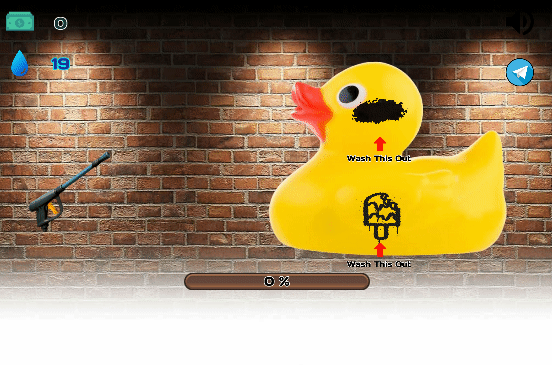

# PowerWash 2D - для Яндекс.Игр

Данный проект представляет собой простейшую механику в 2D - симулятора мойки предметов - Power Wash 2D.

✅ Полностью адаптирован под Яндекс.Игры. 

✅ Есть встроенная настраиваемая поддержка аналитики (сервис GameAnalytics).

✅ Есть поддержка [Флагов](https://yandex.ru/dev/games/doc/ru/config) из Яндекс Консоли (aka remote config flags)

✅ Есть настраиваемся кнопка со ссылкой на сообщество игры в Telegram.

>
> 
> 
> Сказать спасибо автору, оставить отзыв и задать вопросы можно в [Чате Сообщества "Room 606"](https://t.me/TheRoom606Chat) либо здесь в репозитории, создав Issue с вопросом и предложениями.
>
> **Вступай** в наше сообщество в Telegram - [Room 606](https://t.me/TheRoom606) !
>
> *Постигаем такое, что хочется жить!*

# Совместимость с движком

| Compatibility | Version  |
|---------------|----------|
| ✅ Defold     | `1.11.2` |

# Демо

Играбильное демо: **[>> [ИГРАТЬ] <<](https://zugzug90.github.io/powerwash-2d-yg/index.html)**

# Credits
1. GUI & Icons

<a href="https://www.flaticon.com/free-icons/water-drop" title="water drop icons">Water drop icons created by Karacis - Flaticon</a>
<a href="https://www.flaticon.com/free-icons/coin" title="coin icons">Coin icons created by DinosoftLabs - Flaticon</a>

https://kenney.nl/assets/ui-pack

2. Levels, images

1. "Brick wall background" by Alex Dulak is licensed under CC BY 2.0.
1. "Old TV" by stevestein1982 is licensed under CC BY 2.0.
1. "Red Tea Pot" by dlg_images is licensed under CC BY 2.0.
1. "Cute yellow rubber duck toy" is marked with CC0 1.0.

---
